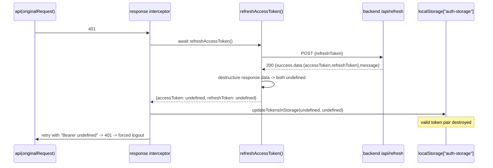

# Design: Align frontend auth clients with the wrapped `{success,data,message}` contract

## Technical Approach

Three destructuring statements move one level deeper (`res.data` → `res.data.data`) and the access-token field is renamed `token` → `accessToken`, matching the backend target contract. No helper, no wrapper, no abstraction: the boundary that already exists (destructuring at the call site) absorbs the whole contract change, so every downstream consumer keeps receiving plain string values.

Backend target contract (from the companion proposal, `success()` in `src/utils/response-formatter.js`):

```text
POST /api/login    -> 200 { success, data: { userId, accessToken, refreshToken, role, user }, message }
POST /api/register -> 201 { success, data: { userId, accessToken, refreshToken, role, user }, message }
POST /api/refresh  -> 200 { success, data: { accessToken, refreshToken }, message }
```

## Data Flow

Current (broken) refresh:



Corrected refresh: identical path, except `refreshAccessToken()` destructures `response.data.data`, returns real strings, `updateTokensInStorage` persists them, `onTokenRefreshed` releases the queue, `notifyTokenRefreshed` syncs Zustand via `App.jsx`, and the original request retries with a valid bearer token — the session continues.

## File Changes

| File | Action | Description |
|------|--------|-------------|
| `src/lib/api.js` (line 224) | Modify | Read tokens from `response.data.data` |
| `src/pages/Auth/index.jsx` (lines 73-76) | Modify | Login: `res.data.data`, `token` → `accessToken`, update stale comment |
| `src/pages/Auth/index.jsx` (lines 112-113) | Modify | Register: `res.data.data`, `token` → `accessToken` |

### `src/lib/api.js:224`

```js
// before
const { accessToken, refreshToken: newRefreshToken } = response.data;
// after
const { accessToken, refreshToken: newRefreshToken } = response.data.data;
```

### `src/pages/Auth/index.jsx:73-76` (login)

```js
// before
// El backend devuelve: token, userId, role, user, refreshToken
const { token, userId, role, user, refreshToken } = res.data;
const roleUsuario = user?.role || role || "minorista";
login(token, refreshToken, userId, roleUsuario);
// after
// El backend devuelve: { success, data: { userId, accessToken, refreshToken, role, user }, message }
const { accessToken, userId, role, user, refreshToken } = res.data.data;
const roleUsuario = user?.role || role || "minorista";
login(accessToken, refreshToken, userId, roleUsuario);
```

### `src/pages/Auth/index.jsx:112-113` (register)

```js
// before
const { token, userId, role = "minorista", refreshToken } = res.data;
login(token, refreshToken, userId, role);
// after
const { accessToken, userId, role = "minorista", refreshToken } = res.data.data;
login(accessToken, refreshToken, userId, role);
```

`useAuthStore.login(token, refreshToken, userId, role)` keeps its positional signature — only the local variable feeding argument 1 is renamed.

## Architecture Decisions

### Decision: no optional chaining on `.data.data`

**Choice**: plain `res.data.data`.
**Alternatives considered**: `res.data?.data ?? res.data` (shape-tolerant fallback); a shared `unwrap()` helper.
**Rationale**: all three sites already sit inside `try/catch`. On an unexpected shape, destructuring `undefined` throws a `TypeError` that the existing catch handles — refresh clears auth and logs out, login/register show the current error alert. That is fail-closed. A fallback would restore exactly the silent `undefined`-token failure this change removes, and a helper would add an abstraction for three lines while hiding the contract at the call site.

### Decision: strictly single-contract client, no dual-shape support

**Choice**: the frontend speaks only the wrapped contract; both PRs ship in one deploy window.
**Alternatives considered**: temporary dual-shape reader for a staged deploy.
**Rationale**: dual-shape code is dead on arrival and would need a second removal PR; the proposal already commits to a paired deploy and a paired revert.

## Explicitly NOT touched (shape-agnostic by construction)

| Component | Location | Why it needs no change |
|-----------|----------|------------------------|
| Concurrent-request queue | `src/lib/api.js:187-204, 263-275` | `isRefreshing` / `refreshSubscribers` / `subscribeTokenRefresh` / `onTokenRefreshed` operate on the two token strings returned by `refreshAccessToken()`. They never see `response.data`. Single-flight semantics are unchanged. |
| Zustand sync | `src/App.jsx:40-58`, `useAuthStore.updateTokens` / `logout` | The callback receives `(token, refreshToken)` positional strings from `notifyTokenRefreshed`. Its `if (token && refreshToken)` branch simply stops taking the failure path once real values arrive. |
| `localStorage` helpers | `getAuthFromStorage`, `updateTokensInStorage`, `clearAuthInStorage` (`src/lib/api.js`) | They move whatever values they are handed into/out of `localStorage["auth-storage"]`; the persisted key stays `token`. |
| `logoutWithApi` | `src/stores/useAuthStore.js:51-73` | Never reads the response body. |
| `classifyError` | `src/lib/api.js:100-103` | Reads `data?.message`, now unreachable under `{error:{message,code}}`; no consumer displays it (documented, out of scope). |
| Auth `catch` blocks | `src/pages/Auth/index.jsx:88-97, 125-134` | Hardcoded SweetAlert copy; never inspect `err.response.status`, so real 401/409 need no adjustment. |

Implementers MUST NOT modify any row above. Reviewers should reject a diff that does.

## Interfaces / Contracts

`refreshAccessToken()` return type is unchanged: `Promise<{accessToken: string, refreshToken: string} | null>`. Only its extraction source changes. This is the invariant that keeps the queue and Zustand sync untouched.

## Application Order and Deploy Coordination

1. `src/lib/api.js:224` — the actual bug; isolated, no dependency on the other two.
2. `src/pages/Auth/index.jsx` login (73-76).
3. `src/pages/Auth/index.jsx` register (112-113).
4. `rg "res\.data\.token"` and `rg "= res\.data;"` in `src/pages/Auth` must return nothing.
5. `npm run build`.

Deploy: single window, backend first or simultaneous. Steps 2-3 break login/register against the *current* backend, so local verification of cases 1-6 requires the backend change already running locally. Neither PR merges alone; rollback reverts both commits together (partial revert reintroduces the mismatch).

## Testing Strategy

No test runner (`openspec/config.yaml` → `testing.runner: none`). Verification is manual against the 6 cases in `exploration.md`, executed with the updated backend running and DevTools Network + Application → Local Storage open.

| Case (`exploration.md`) | Manual procedure | Pass condition |
|---|---|---|
| 1 — refresh success | Log in, expire/corrupt the access token in `auth-storage`, trigger an authenticated request | one `/api/refresh` 200; `auth-storage.token` becomes a new non-`undefined` JWT; original request returns 200; no logout |
| 2 — invalid refresh token | Replace `refreshToken` with garbage, trigger an authenticated request | `/api/refresh` 401; `auth-storage` cleared; queued requests rejected; UI shows logged-out state |
| 3 — rotation | After case 1, replay the previous refresh token | old token rejected (401); new token present in storage |
| 4 — logout | Click logout with the network throttled/offline | Zustand and storage cleared immediately regardless of `/api/logout` outcome |
| 5 — concurrency | Load a view firing several authenticated requests with an expired access token | exactly one `/api/refresh` in Network; every queued request retries once and succeeds |
| 6 — login/register regression | Full login, then register a new email | session established, `token` in storage is the real `accessToken`, redirect to `/`; invalid credentials still show the existing SweetAlert copy |

Verification of each step maps 1:1 to a success criterion in `proposal.md`.

## Threat Matrix

N/A — no routing, shell, subprocess, VCS/PR automation, executable-file classification, or process-integration boundary. Change is client-side data extraction only.

## Migration / Rollout

No migration. Existing persisted sessions keep working: the storage schema is untouched, and a session whose token pair was already destroyed by the bug simply requires one re-login.

## Open Questions

- None.
